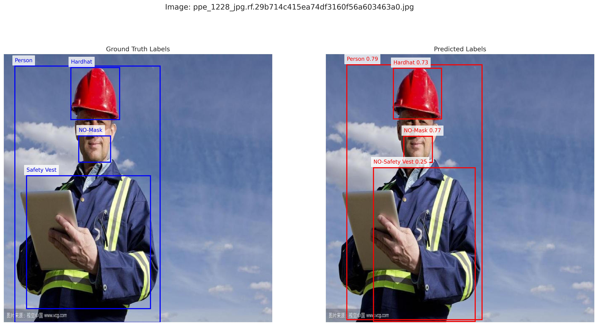

# YOLOv11 Training for PPE Detection on Construction Sites
<div align="center">

</div>

## 📌 Overview

This project focuses on training a **YOLOv11 model** to detect **Personal Protective Equipment (PPE)** in images from construction sites. The objective is to identify critical safety items such as hard hats, masks, and safety vests, as well as their absence, alongside detecting persons, machinery, and vehicles in complex construction environments. The **YOLOv11n (Nano)** variant was selected for its optimal balance of speed and accuracy, making it suitable for environments with potential computational constraints.

The training process involved meticulous dataset preprocessing, hyperparameter tuning, and data augmentation to enhance detection performance. This README provides a detailed guide to the project setup, dataset preparation, model training, evaluation, and future improvements.

<div align="center">

</div>

## 📊 Dataset

### Source
The dataset used is the **[Construction Site Safety Image Dataset](https://www.kaggle.com/datasets/snehilsanyal/construction-site-safety-image-dataset-roboflow)** from Roboflow, available on Kaggle. It contains images of construction sites with annotations for various PPE items and related objects.

### Classes
The model is trained to detect the following **10 classes**:
- **0: Hardhat**
- **1: Mask**
- **2: NO-Hardhat**
- **3: NO-Mask**
- **4: NO-Safety Vest**
- **5: Person**
- **6: Safety Cone**
- **7: Safety Vest**
- **8: Machinery**
- **9: Vehicle**

### Preprocessing
- **Dataset Split**: The dataset was divided into training (80%), validation (15%), and test (5%) sets to ensure robust evaluation.
- **Structure**: The dataset follows the standard YOLO format:
  ```
  dataset_root/
  ├── train/
  │   ├── images/
  │   └── labels/
  ├── valid/
  │   ├── images/
  │   └── labels/
  └── test/
      ├── images/
      └── labels/
  ```
- **Data Integrity Check**: The dataset was verified to ensure all images have corresponding label files and vice versa. For example:
  - **Train Set**: 2605 images, 2605 labels, no missing files.
  - **Valid Set**: 114 images, 114 labels, no missing files.
  - **Test Set**: 114 images, 114 labels, no missing files.

### Data Augmentation
To address class imbalance, particularly for underrepresented classes like **Safety Cone** and **Vehicle**, the following augmentation was applied:
- **Horizontal Flipping**: Images containing these classes were flipped to increase their representation.
- Additional augmentations included:
  - **Blur** (p=0.01, blur_limit=(3, 7))
  - **MedianBlur** (p=0.01, blur_limit=(3, 7))
  - **ToGray** (p=0.01)
  - **CLAHE** (p=0.01, clip_limit=(1.0, 4.0))

<div align="center">
  
</div>

## 🛠️ Model & Training

### Model
- **Model**: YOLOv11n (`yolo11n.pt`) from Ultralytics, a lightweight model with 2,591,790 parameters and 6.5 GFLOPs.
- **Framework**: Ultralytics YOLO library, leveraging PyTorch for efficient GPU-accelerated training.

### Training Configuration
The training was conducted in a Kaggle environment with a **Tesla T4 GPU**. Key parameters include:
- **Epochs**: 100 (3 in debug mode)
- **Batch Size**: 12 (4 in debug mode)
- **Image Size**: 640x640
- **Device**: CUDA (GPU)
- **Optimizer**: AdamW (auto-selected with lr=0.000714, momentum=0.9)
- **Augmentations**: Applied via Albumentations (see [Data Augmentation](#data-augmentation)).
- **Verbose**: Disabled to suppress detailed logs.
- **Show Labels/Conf/Boxes**: Disabled for cleaner console output.

### Training Code
The training process is implemented as follows:

```python
from ultralytics import YOLO

# Load the pre-trained YOLOv11n model
model = YOLO('yolo11n.pt')

# Train the model
results = model.train(
    data='path/to/your/data.yaml',
    epochs=100,
    imgsz=640,
    batch=12,
    device='cuda',
    rect=False,
    verbose=False,
    show_labels=False,
    show_conf=False,
    show_boxes=False
)
```

## 📈 Results

The trained YOLOv11n model achieved the following performance metrics on the validation set:
- **mAP50**: **76.3%**
- **mAP50-95**: **52.4%**
- **Precision**: 86.7%
- **Recall**: 68.7%

These results demonstrate strong detection capabilities for PPE items in construction environments. The training metrics were saved to a CSV file for further analysis:

```python
train_metrics = {
    "train_id": f"train_{pd.Timestamp.now().strftime('%Y%m%d_%H%M%S')}",
    "model": "yolo11n.pt",
    "mAP50": 0.763,
    "mAP50-95": 0.524,
    "Precision": 0.867,
    "Recall": 0.687,
    "train_time": 3815.760
}
```

<div align="center">

</div>

## ⚙️ Setup & Installation

### Prerequisites
- **Python**: 3.11.11
- **Hardware**: NVIDIA GPU (e.g., Tesla T4) with CUDA support
- **Environment**: Kaggle notebook or similar with internet access

### Installation
1. **Clone the Repository**:
   ```bash
   git clone <your-repo-url>
   cd <your-repo-directory>
   ```
2. **Install Dependencies**:
   ```bash
   pip install ultralytics numpy pandas matplotlib seaborn opencv-python Pillow PyYAML torch torchvision
   ```
   *Note*: Ensure compatibility by checking specific versions in the notebook environment (e.g., `ultralytics==8.3.113`, `torch==2.5.1+cu124`).

3. **Disable Weights & Biases (Optional)**:
   ```bash
   wandb disabled
   ```

## 🚀 Usage

### 1. Prepare Dataset
- Organize the dataset as described in the [Dataset](#dataset) section.
- Create a `data.yaml` file specifying paths and class names:
  ```yaml
  train: /path/to/train
  val: /path/to/valid
  test: /path/to/test
  nc: 10
  names: ["Hardhat", "Mask", "NO-Hardhat", "NO-Mask", "NO-Safety Vest", "Person", "Safety Cone", "Safety Vest", "Machinery", "Vehicle"]
  ```

### 2. Train the Model
Run the training script as shown in the [Training Code](#training-code) section. Ensure the `data.yaml` path is correct.

### 3. Run Inference
Use the trained model (`best.pt`) for detection on new images or videos:
```python
from ultralytics import YOLO

# Load the trained model
model = YOLO('/kaggle/working/runs/detect/train/weights/best.pt')

# Run inference
results = model.predict(source='path/to/image.jpg', save=True)
```

**Insert Image Here: Inference Example**
*Caption: Example of model inference on a test image with detected PPE items.*

### 4. Save Model
The trained model is saved as a dataset:
```python
from shutil import copyfile
copyfile('/kaggle/working/runs/detect/train/weights/best.pt', '/kaggle/working/best.pt')
```

Metadata is also saved:
```python
import json
metadata = {
    "model": "YOLO11",
    "description": "Trained YOLO11 (yolo11n.pt) model on PPE detection dataset",
    "source": "Construction Site PPE detection w/ YOLO v11 notebook"
}
with open('/kaggle/working/metadata.json', 'w') as f:
    json.dump(metadata, f)
```

## 📊 Model Comparison

The project tested different YOLOv11 variants, with the following recorded results:
| Train ID              | Model      | mAP50  | mAP50-95 | Precision | Recall | Train Time (s) | Epochs | Batch | Image Size |
|-----------------------|------------|--------|----------|-----------|--------|----------------|--------|-------|------------|
| train_20250506_115707 | yolo11n.pt | 0.763 | 0.524 | 0.867  | 0.687 | 3815.760         | 100      | 12     | 640        |
| train_20250506_081916 | yolo11n.pt | 0.711 | 0.468 | 0.853  | 0.629 |  1151.180        | 30     | 12    | 640        |
| train_20250212_204638 | yolo11n.pt | 0.200 | 0.094 | 0.309  | 0.264 | 102.070         | 3      | 4     | 640        |

<div align="center">

</div>

## 🔮 Future Improvements

To further enhance model performance, consider the following:
- **Advanced Data Augmentation**: Implement techniques like mosaic augmentation, rotation, or color jittering to improve class diversity.
- **Extended Training**: Increase the number of epochs (e.g., to 100) for better convergence.
- **Larger Models**: Experiment with YOLOv11s or YOLOv11m if computational resources are available.
- **Real-World Testing**: Evaluate the model on diverse, unseen construction site images to assess generalization.
- **Class Imbalance Handling**: Apply techniques like weighted loss or oversampling for underrepresented classes.

## 📖 References

This project builds upon the following resources:
- [YOLOv8 Finetuning for PPE Detection](https://www.kaggle.com/code/hinepo/yolov8-finetuning-for-ppe-detection) by HinePo
- [Ultralytics YOLO11 Notebook](https://www.kaggle.com/code/glennjocherultralytics/ultralytics-yolo11-notebook) by Glenn Jocher
- [Detection Using YOLOv11](https://www.kaggle.com/code/myriamgam62/detection-using-yolov11) by Myriam Gam62

## 📜 Dataset Citation

```bibtex
@misc{ construction-site-safety_dataset,
    title = { Construction Site Safety Dataset },
    type = { Open Source Dataset },
    author = { Roboflow Universe Projects },
    howpublished = { \url{ https://universe.roboflow.com/roboflow-universe-projects/construction-site-safety } },
    url = { https://universe.roboflow.com/roboflow-universe-projects/construction-site-safety },
    journal = { Roboflow Universe },
    publisher = { Roboflow },
    year = { 2023 },
    month = { mar },
    note = { visited on 2024-05-14 }
}
```
